# TienKung-Lab: TienKung 的直连 IsaacLab 工作流

[](https://docs.omniverse.nvidia.com/isaacsim/latest/overview.html)
[](https://isaac-sim.github.io/IsaacLab)
[](https://github.com/leggedrobotics/rsl_rl)
[](https://docs.python.org/3/whatsnew/3.10.html)
[](https://releases.ubuntu.com/22.04/)
[](https://opensource.org/licenses/BSD-3-Clause)
[](https://pre-commit.com/)

<div align="center">
  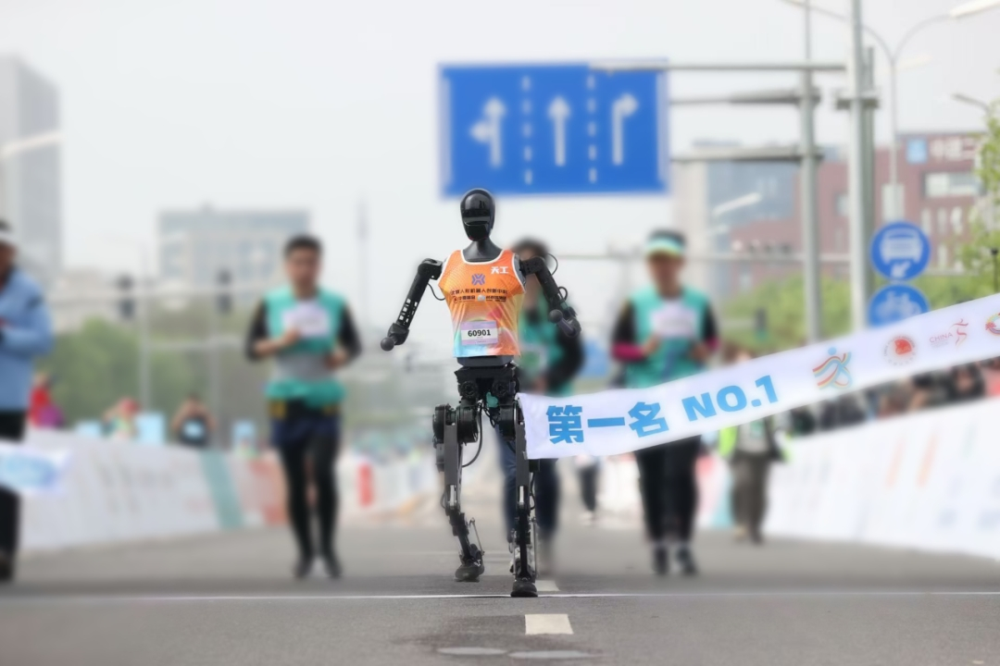
  <br>
  <b><span style="font-size:1.2em;">TienKung 人形机器人在首届人形机器人半程马拉松比赛中获得冠军</span></b>
  <br>
</div>


## 概述

| 动作 |              AMP 动画               |                     传感器                      |                   RL + AMP                    |                   Sim2Sim                   |
| :----: | :--------------------------------------: | :----------------------------------------------: | :-------------------------------------------: | :-----------------------------------------: |
|  行走  | 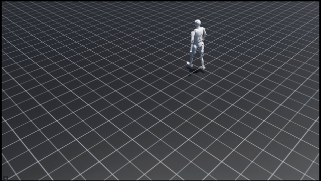 |  | 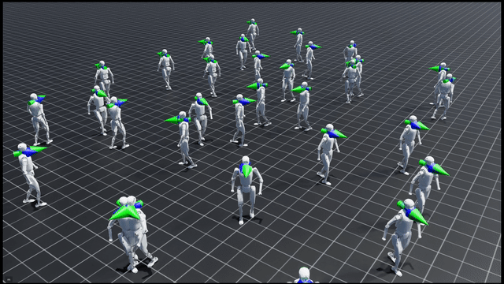 | 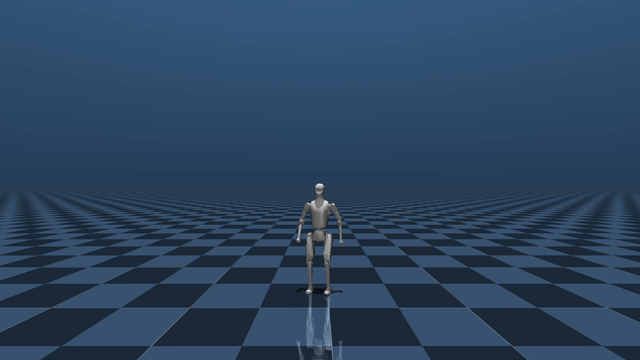 |
|  跑步   | 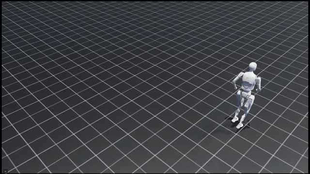  |   | 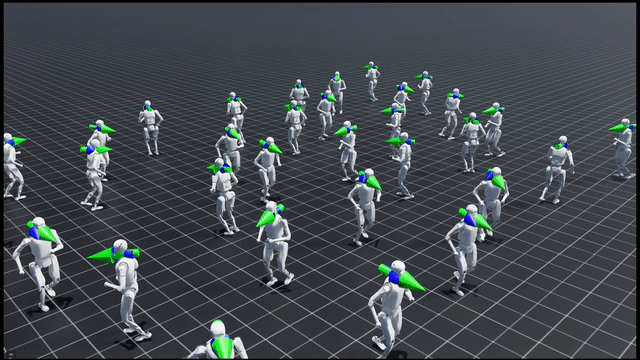  | 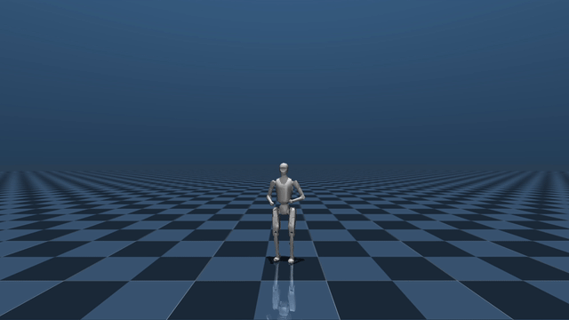  |

该框架是一个基于强化学习的运动控制系统，专为全尺寸人形机器人 TienKung 设计。它集成了 AMP 风格的奖励和周期性步态奖励，促进自然、稳定和高效的行走和跑步行为。

该代码库基于 IsaacLab 构建，支持向 MuJoCo 的 Sim2Sim 迁移，并具有模块化架构，便于无缝定制和扩展。此外，它还集成了基于光线投射的传感器以增强感知能力，实现精确的环境交互和避障。该框架已在真实的 TienKung 机器人上成功验证。

## 待办事项列表
- [x] 运动重定向支持 2025-09-27
- [x] 添加 sim2real 演示 2025-11-07
- [x] 添加部署[仓库](https://github.com/Open-X-Humanoid/Deploy_Tienkung.git)的超链接 2025-11-19
- [ ] 添加更多传感器
- [ ] 添加感知控制

## 安装
TienKung-Lab 基于 IsaacSim 4.5.0 和 IsaacLab 2.1.0 构建。

- 按照[安装指南](https://isaac-sim.github.io/IsaacLab/main/source/setup/installation/index.html)安装 Isaac Lab。我们推荐使用 conda 安装，因为它简化了从终端调用 Python 脚本的过程。

- 将此仓库与 Isaac Lab 安装分开克隆（即在 `IsaacLab` 目录之外）

- 使用已安装 Isaac Lab 的 Python 解释器，安装该库

```bash
cd TienKung-Lab
pip install -e .
```
- 安装 rsl-rl 库

```bash
cd TienKung-Lab/rsl_rl
pip install -e .
```

- 通过运行以下命令验证扩展是否正确安装：

```bash
python legged_lab/scripts/train.py --task=walk  --logger=tensorboard --headless --num_envs=64
```

## 使用方法

### 运动重定向

| AMASS  |  GMR               |                     TIENKUNGLAB                      | 
| :----: | :--------------------------------------: | :----------------------------------------------: | 
| 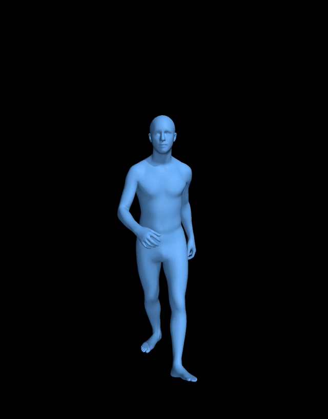   | 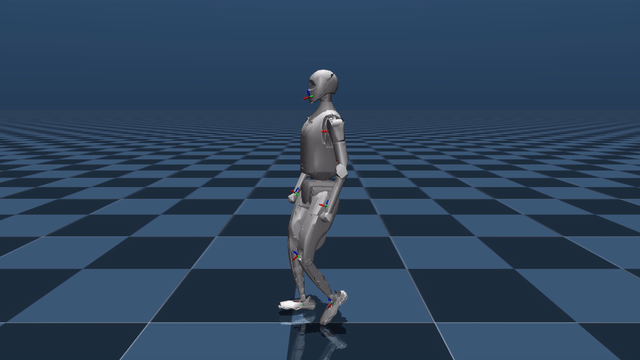 | 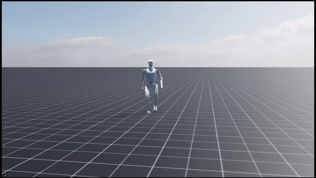 | 

本节使用 [GMR](https://github.com/YanjieZe/GMR) 进行运动重定向，Tienkung 目前仅支持 SMPLX 类型（AMASS、OMOMO）的运动重定向。

**1. 准备数据集并使用 [GMR](https://github.com/YanjieZe/GMR) 进行运动重定向。**
```bash
python scripts/smplx_to_robot.py --smplx_file <path_to_smplx_data> --robot tienkung  --save_path <path_to_save_robot_data.pkl>
```
**2. 数据处理和数据保存。**

数据集由两个具有不同功能和格式的部分组成，需要分两步进行转换。

- **`motion_visualization/`**  
  用于使用 `play_amp_animation.py` 进行运动播放，以检查运动的正确性和质量。  
  数据字段：  [root_pos, root_rot, dof_pos, root_lin_vel, root_ang_vel, dof_vel]

- **`motion_amp_expert/`**  
  在训练期间用作 AMP 的专家参考数据。  
  数据字段：  [dof_pos, dof_vel, end-effector pos]
  
- **步骤 1：数据处理和可视化数据保存。**

```bash
python legged_lab/scripts/gmr_data_conversion.py --input_pkl <path_to_save_robot_data.pkl> --output_txt legged_lab/envs/tienkung/datasets/motion_visualization/motion.txt
```

**注意**：在开始步骤 2 之前，请将配置文件中的 `amp_motion_files_display` 路径设置为步骤 1 生成的文件。

- **步骤 2：运动可视化和专家数据保存。**
```bash
python legged_lab/scripts/play_amp_animation.py --task=walk --num_envs=1 --save_path legged_lab/envs/tienkung/datasets/motion_amp_expert/motion.txt --fps 30.0
```
**注意**：步骤 2 完成后，请将配置文件中的 `amp_motion_files` 路径设置为步骤 2 生成的文件。

### 可视化运动

通过使用来自 tienkung/datasets/motion_visualization 的数据更新仿真来可视化运动。

```bash
python legged_lab/scripts/play_amp_animation.py --task=walk --num_envs=1
python legged_lab/scripts/play_amp_animation.py --task=run --num_envs=1
```

### 使用传感器可视化运动

通过使用来自 tienkung/datasets/motion_visualization 的数据更新仿真来可视化带传感器的运动。

```bash
python legged_lab/scripts/play_amp_animation.py --task=walk_with_sensor --num_envs=1
python legged_lab/scripts/play_amp_animation.py --task=run_with_sensor --num_envs=1
```

### 训练

使用来自 tienkung/datasets/motion_amp_expert 的 AMP 专家数据训练策略。

```bash
python legged_lab/scripts/train.py --task=walk --headless --logger=tensorboard --num_envs=4096
python legged_lab/scripts/train.py --task=run --headless --logger=tensorboard --num_envs=4096
```

### 运行

运行训练好的策略。

```bash
python legged_lab/scripts/play.py --task=walk --num_envs=1
python legged_lab/scripts/play.py --task=run --num_envs=1
```

### Sim2Sim(MuJoCo)

在 MuJoCo 中评估训练好的策略以执行跨仿真验证。

Exported_policy/ 包含项目提供的预训练策略。使用 play 脚本时，训练好的策略会自动导出并保存到类似 logs/run/[timestamp]/exported/policy.pt 的路径。
```bash
python legged_lab/scripts/sim2sim.py --task walk --policy Exported_policy/walk.pt --duration 100
```

### Sim2Real
TienKung-Lab 的结果已在真实的 **TienKung** 机器人上成功验证。

有关部署详情，请参考[此仓库](https://github.com/Open-X-Humanoid/Deploy_Tienkung.git)。

**安全提示：** 在真实机器人上测试存在风险。RL 策略可能导致意外或剧烈的运动，因此请确保已购买意外保险且紧急停止功能正常工作。

<p align="center">
  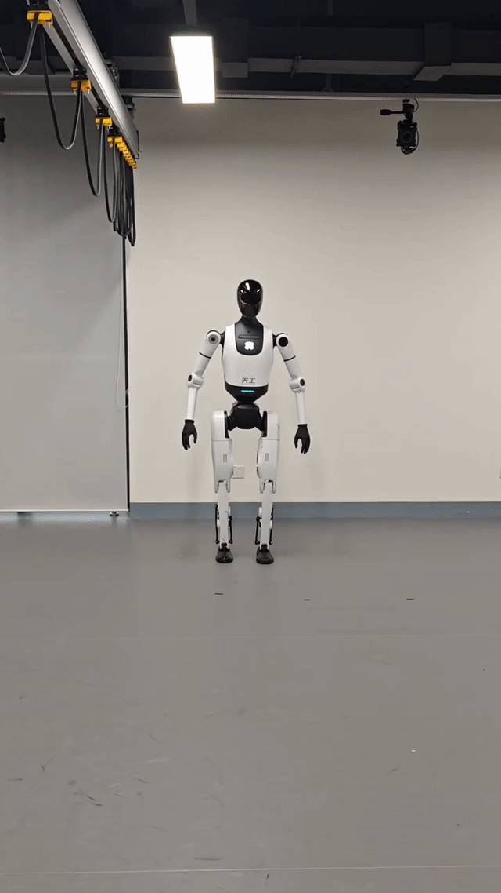
</p>

## 代码格式化

我们有一个 pre-commit 模板来自动格式化您的代码。
要安装 pre-commit：

```bash
pip install pre-commit
```

然后您可以运行 pre-commit：

```bash
pre-commit run --all-files
```

## 故障排除

### Pylance 缺少扩展索引

在某些 VsCode 版本中，部分扩展的索引缺失。在这种情况下，请在 `.vscode/settings.json` 中的 `"python.analysis.extraPaths"` 键下添加扩展的路径。

```json
{
    "python.analysis.extraPaths": [
        "${workspaceFolder}/legged_lab",
        "<path-to-IsaacLab>/source/isaaclab_tasks",
        "<path-to-IsaacLab>/source/isaaclab_mimic",
        "<path-to-IsaacLab>/source/extensions",
        "<path-to-IsaacLab>/source/isaaclab_assets",
        "<path-to-IsaacLab>/source/isaaclab_rl",
        "<path-to-IsaacLab>/source/isaaclab",
    ]
}
```

## 致谢
* [GMR](https://github.com/YanjieZe/GMR): 通用运动重定向。
* [Legged Lab](https://github.com/Hellod035/LeggedLab): 腿式机器人的直连 IsaacLab 工作流。
* [Humanoid-Gym](https://github.com/roboterax/humanoid-gym): 基于 NVIDIA Isaac Gym 的强化学习（RL）框架，支持 Sim2Sim。
* [RSL RL](https://github.com/leggedrobotics/rsl_rl): 快速简单的 RL 算法实现。
* [AMP_for_hardware](https://github.com/Alescontrela/AMP_for_hardware?tab=readme-ov-file): 使用对抗运动先验从短参考运动学习技能的代码库。
* [Omni-Perception](https://acodedog.github.io/OmniPerceptionPages/): 腿式机器人的感知库，提供一套传感器和感知算法。
* [Warp](https://github.com/NVIDIA/warp): 用于编写高性能仿真和图形代码的 Python 框架。

## 讨论
如果您对 TienKung-Lab 感兴趣，欢迎加入我们的微信群进行讨论。


